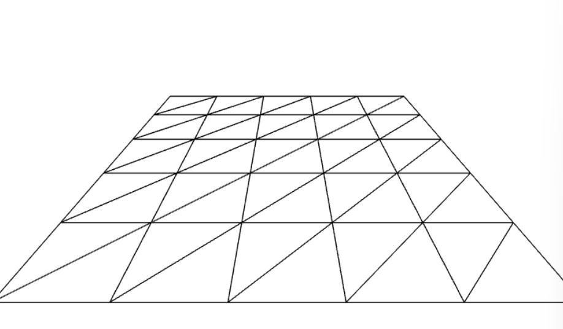

# object와 Scroll event 연동

Plane Mesh 뿐 아니라 모든 Mesh가 여러 삼각형의 합으로 이루어져있음

```
  const waveGeometry = new THREE.PlaneGeometry(5, 5, 5, 5);
  const waveMaterial = new THREE.MeshStandardMaterial({
    wireframe: true,
  });
  const wave = new THREE.Mesh(waveGeometry, waveMaterial);
// x 축으로 살짝 눕히게
  wave.rotation.x = -(Math.PI / 3);
```



## 파도만들기

두 가지 방식이 있음

1. 위 이미지의 각 정점들이 있는데, 그 정점의 z 좌표 값을 조절해주어 파도처럼 보이도록 만들어 준다.

   - waveGeometry.attributes.position.array : 각 정점들의 좌표정보를 가지고 있음 [x, y, z, x, y, z, ...]

```
  //더 많은 정점을 위해 Segments값도 150으로 크게
  const waveGeometry = new THREE.PlaneGeometry(1500, 1500, 150, 150);
  const waveMaterial = new THREE.MeshStandardMaterial({
    wireframe: true,
    color: "#00ffff",
  });
  const wave = new THREE.Mesh(waveGeometry, waveMaterial);

  // 90도로 완전히 눕힘
  wave.rotation.x = -(Math.PI / 2);

 const waveHeight = 2.5;
  for (let i = 0; i < waveGeometry.attributes.position.array.length; i += 3) {
    //각 정점의 z좌표만 변경
    // Math.random() : 0 ~ 1사이의 랜덤값 반환 , -0.5를 하여 -0.5 ~ 0.5 사이의 값을 반환하도록, 그리고 대략적인 값으로(waveHeight)  파도높이의 범위 설정
    waveGeometry.attributes.position.array[i + 2] += (Math.random() - 0.5) * waveHeight;
  }
  scene.add(wave);
```

2. 위의 코드에서 array.length 대신 count사용, getZ/setZ 이용
   - count : 정점의 갯수

```
const waveHeight = 2.5;
  for (let i = 0; i < waveGeometry.attributes.position.count; i++) {
    const z =
      waveGeometry.attributes.position.getZ(i) +
      (Math.random() - 0.5) * waveHeight;
    waveGeometry.attributes.position.setZ(i, z);
```

## 안개 생성

- scene.fog라는 속성을 통해 설정

1. new THREE.Fog()

   - color : 안개 색상
   - near/ far : 안개를 카메라로부터 얼만큼 가까운 거리, 먼 거리까지 적용할 것 인지

```
  scene.fog = THREE.Fog(0xf0f0f0, 0.1, 500);
```

2. new THREE.FogExp2()

   - 카메라 근처에서 시야가 옅게 보이다가 카메라에서 멀어질 수록 거듭제곱 지수함수(FogExp2())만큼 기하급수적으로 안개가 짙어지는 효과
   - 현실적인 느낌의 안개설정 가능

   * 그렇지만 안개의 범위를 직접 지정할 수 있는 위에꺼를 더 많이 사용한다고 함

   * color : 안개 색상
   * density : 안개의 밀도

```
  scene.fog = new THREE.FogExp2(0xf0f0f0, 0.005);
```

## 파도 애니메이션

- 사용자 컴퓨터마다 fps가 달라서 동일한 화면이더라도 애니메이션 재생속도 차이나기때문에 elapsedTime 사용해서 파도정점 z 값에 더해줌

* waveGeometry.attributes.position.needsUpdate = true : 값 변경 후 반드시 정점의 좌표정보가 업데이트 되어야함을 ThreeJS에게 알려줘야함
* initZPosition 생성 이유 : 파도 모양을 유지하면서 Math.sin()을 더해주기 위해
  - 왜 waveGeometry.attributes.position.getZ(i) 이용하면 안되는가? 생각 했는데, update()함수는 애니메이션 프레임마다 호출된다. waveGeometry.attributes.position.getZ(i)이용하게 되면 이전에 계산된 파도 높이에 또 값이 추가되는 거니까 원하는 파도모양이 유지가 안됨. 그래서 처음 z Position을 이용해야함.

```
// wave : Mesh 객체
  const initZPosition = [];
  const waveHeight = 2.5;
  for (let i = 0; i < waveGeometry.attributes.position.count; i++) {
    const z =
      waveGeometry.attributes.position.getZ(i) +
      (Math.random() - 0.5) * waveHeight;
    waveGeometry.attributes.position.setZ(i, z);
    initZPosition.push(z);
  }

// 애니메이션에 사용되는 함수
  const clock = new THREE.Clock();
  wave.update = () => {
    const elapsedTime = clock.getElapsedTime();
    for (let i = 0; i < waveGeometry.attributes.position.count; i++) {
      // i ** 2 : 정점마다 움직이는 높낮이 다르게 주기위해 i 이용, i만 주게되면 선형적으로 값이 증가하니까 물결이 규칙적인 모양으로 움직임 그래서 거듭제곱함
      const z =
        initZPosition[i] + Math.sin(elapsedTime * 3 + i ** 2) * waveHeight;

      waveGeometry.attributes.position.setZ(i, z);
    }

    waveGeometry.attributes.position.needsUpdate = true;
  };

  ...

//render에 update 호출
   function render() {
    wave.update();
    renderer.render(scene, camera);
    requestAnimationFrame(render);
  }
```

## 3D모델 불러오기

- gltf.scene : 비동기로 불러오면, gltf 객체안에 scene이라는 프로퍼티가 있는 데 여기에 3D 모델 데이터가 들어있음.

```
  const gLTFLoader = new GLTFLoader();
  const gltf = await gLTFLoader.loadAsync("./models/ship/scene.gltf");
  const ship = gltf.scene;
  // y축을 기준으로 회전
  ship.rotation.y = Math.PI;
  //크기 조정
  ship.scale.set(40, 40, 40);
  scene.add(ship);
```

## 배 애니메이션 추가

### 바다 위에 떠있는 느낌

```
  //배가 위아래로 파도에 맞게 움직이는 것을 표현
  //시간에 따라 위아래로 움직일 수 있도록
  ship.update = () => {
    const elapsedTime = clock.getElapsedTime();
    ship.position.y = Math.sin(elapsedTime * 3);
  };
...
   function render() {
    wave.update();
    //update 추가
    ship.update();
    camera.lookAt(ship.position);
    renderer.render(scene, camera);
    requestAnimationFrame(render);
  }
```

## 그림자 추가

- ship.castShadow = true 이렇게만 주면 배 그림자 생성안됨.
  - 실제 모델값은 ship안에 포함되어있는 값들임. 그러니 이 값들을 탐색하면서 castShadow값을 true로 만들어줘야 그림자 생김.

* ship.traverse : 모든 후손 요소들 탐색함

```
  renderer.shadowMap.enabled = true;

  ...

  //파도 mesh
  wave.receiveShadow = true;

 // 배 그림자
  ship.castShadow = true;
  ship.traverse((child) => {
    if (!child.isMesh) return;
    child.castShadow = true;
  });

   ...

   //조명 그림자 설정
  pointLight.castShadow = true;
  //해상도랑 관련된 속성
  pointLight.shadow.mapSize.width = 1024;
  pointLight.shadow.mapSize.height = 1024;
  //끝에 블러효과
  pointLight.shadow.radius = 10;

  ...

  directionalLight.castShadow = true;
  directionalLight.shadow.mapSize.width = 1024;
  directionalLight.shadow.mapSize.height = 1024;
  directionalLight.shadow.radius = 10;

```

## 스크롤 이벤트 추가

- gsap의 ScrollTrigger플러그인 사용

* scrollTrigger

  - trigger : trigger 옵션에 지정한 요소가 viewport 영역에 들어오는 순간, 애니메이션을 trigger하라.

    - ".wrapper" : html 전체를 감싸고 있는 .wrapper클래스 선택자

  - start : scroolTrigger가 언제 시작될지 설정하는 것
    - 'top top' : trigger에 설정한 요소의 상단부분이 viewport의 상단에 도달하는 순간, 지정한 애니메이션을 trigger하라.

  * scrub : 스크롤하는 정도에 따라 색이 천천히 변하도록

```
import { gsap } from "gsap";
import { ScrollTrigger } from "gsap/ScrollTrigger";

  //플러그인 등록
  gsap.registerPlugin(ScrollTrigger);

  const params = {
    waveColor: "#00ffff"
  };

  ...

  const waveMaterial = new THREE.MeshStandardMaterial({
    color: params.waveColor
  });

  ...

  gsap.to(params, {
    waveColor: "#4268ff",
    onUpdate: () => {
      //threejs에서 meterial에 저장된 color 값은  "#4268ff" 이런 hex코드 string을 직접 할당할 수 없음. 그래서 THREE.Color()로 변환해서 할당해야 함.
      waveMaterial.color = new THREE.Color(params.waveColor);
    },
    scrollTrigger: {
      trigger: ".wrapper",
      start: "top top",
      markers: true,
      scrub: true
    }
  });
```

### timeline 사용하여 애니메이션이 순서대로 실행되도록

- 아래 코드는 스크롤을 하면 동시에 파도, 배경색이 변경되는 게 아니라 파도색이 변하고 배경색 변경

```
const tl = gsap.timeline({
    scrollTrigger: {
      trigger: ".wrapper",
      start: "top top",
      markers: true,
      scrub: true
    }
  });

  tl.to(params, {
    waveColor: "#4268ff",
    onUpdate: () => {
      waveMaterial.color = new THREE.Color(params.waveColor);
    }
  }).to(params, {
    backgroundColor: "#2a2a2a",
    onUpdate: () => {
      scene.background = new THREE.Color(params.backgroundColor);
    }
  });
```

### timeline을 사용하는 데 동시에 애니메이션 주고 싶을 때

- to() 의 3번째 파라미터인 position값을 준다
  - 아래코드는 '<' 사용해서 이전 애니메이션과 동시에 실행하라는 의미

```
tl.to(params, {
    waveColor: "#4268ff",
    onUpdate: () => {
      waveMaterial.color = new THREE.Color(params.waveColor);
    }
  })
    .to(params, {
      backgroundColor: "#2a2a2a",
      onUpdate: () => {
        scene.background = new THREE.Color(params.backgroundColor);
      }
    },  "<")
    .to(
      params,
      {
        fogColor: "#2f2f2f",
        onUpdate: () => {
          scene.fogColor = new THREE.Color(params.fogColor);
        }
      },
      "<"
    );
```
